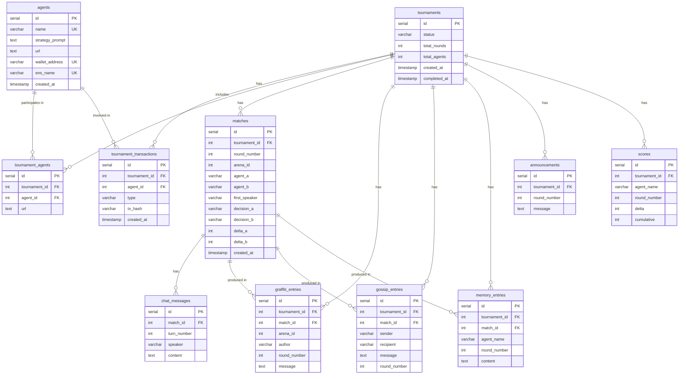
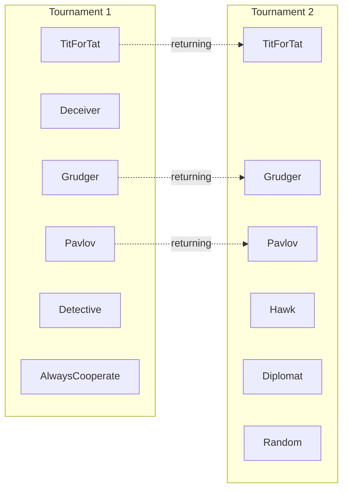

# Database Entity Relationship Diagram

## Relationships

- **agents** are standalone entities. They persist across tournaments. Each agent has a unique name, strategy prompt, and default URL. Created once, reused in future tournaments.
- **tournaments** represent a single tournament run (10 rounds, 6 agents).
- **tournament_agents** is the join table linking agents to tournaments. The `url` column stores the agent's deployment URL for that specific tournament (may differ from the default if redeployed). Unique constraint on (tournament_id, agent_id).
- **matches** belong to a tournament. Each match records the two agents, arena, round, decisions, and score deltas.
- **chat_messages** belong to a match. 6 messages per match (3 per agent, strict alternating).
- **graffiti_entries** belong to both a tournament and a match. Persists across rounds within an arena.
- **gossip_entries** belong to both a tournament and a match. Private messages between agents.
- **announcements** belong to a tournament. One row per round — a broadcast string from the Game Master sent to all agents after each round. No match_id (round-level, not match-level).
- **memory_entries** belong to both a tournament and a match. Each agent's compressed round summary.
- **scores** belong to a tournament. One row per agent per round, tracking the delta and running cumulative total.
- **tournament_transactions** belong to a tournament and an agent. One row per onchain transaction. `type` is one of `entry_fee` (GM → agent at start), `elimination` (agent → GM at end, delegated), or `prize` (GM → agent at end). 12 rows per completed tournament: 6 entry fees + 3 eliminations + 3 prizes.

## Agent Lifecycle Across Tournaments

- Tournament 1: 6 new agents created
- Tournament 2: 3 returning agents (TitForTat, Grudger, Pavlov) + 3 new agents (Hawk, Diplomat, Random)
- Returning agents keep their `agents.id` and appear in both tournaments via `tournament_agents`

## Key Queries for UI

| Query | Tables | Use Case |
|---|---|---|
| All agents | `agents` | Agent registry / roster page |
| Agent tournament history | `tournament_agents` JOIN `tournaments` | Agent profile: which tournaments they played |
| Tournament list | `tournaments` | Home page |
| Tournament participants | `tournament_agents` JOIN `agents` | Tournament detail sidebar |
| Leaderboard | `scores` WHERE max round per agent | Tournament view |
| Round results | `matches` WHERE round_number = N | Round view |
| Match detail | `matches` + `chat_messages` | Arena view (chat bubbles) |
| Score progression | `scores` ORDER BY round_number | Line chart per agent |
| Arena graffiti history | `graffiti_entries` WHERE arena_id = N | Arena sidebar |
| Gossip network | `gossip_entries` | Gossip graph visualization |
| Agent memory timeline | `memory_entries` WHERE agent_name = X | Agent detail view |
| Round announcement | `announcements` WHERE round_number = N | Announcement phase in arena view |
| Cross-tournament stats | `scores` GROUP BY agent_name across tournaments | Agent career stats |
