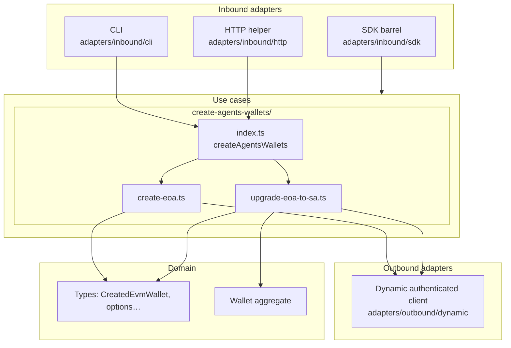

# wallet

Server-side EVM wallet creation using [Dynamic](https://www.dynamic.xyz/)’s Node EVM client (`@dynamic-labs-wallet/node-evm`). This package authenticates with your Dynamic environment, runs MPC key generation for new accounts, upgrades EOAs to ERC-7702 smart accounts (MetaMask Stateless7702), and exposes the result as domain snapshots (or you can import the helpers from your own code).

## Requirements

- Node.js 20+ (recommended)
- [pnpm](https://pnpm.io/) (see `packageManager` in `package.json`)

## Setup

1. From the repo root, install dependencies for this package:

   ```bash
   cd wallet && pnpm install
   ```

2. Copy the example env file and fill in values from the [Dynamic API / developer settings](https://app.dynamic.xyz/dashboard/developer/api):

   ```bash
   cp .env.example .env
   ```

   | Variable | Required | Description |
   |----------|----------|-------------|
   | `DYNAMIC_AUTH_TOKEN` | Yes | Server API token for Dynamic |
   | `DYNAMIC_ENVIRONMENT_ID` | Yes | Your Dynamic environment ID |
   | `WALLET_PASSWORD` | No | Optional password passed to wallet creation when supported |

## Architecture

The package follows **hexagonal-style** layering: **inbound adapters** call **use cases**, which orchestrate **outbound adapters** and the **domain** model.



### Layers (what lives where)

| Layer | Path | Role |
|-------|------|------|
| **Inbound adapters** | `src/adapters/inbound/` | **CLI**, **HTTP** (`runCreateWalletsFromHttpBody`), and a small **SDK** re-export (`internal-api`) so other packages can import a stable surface. They parse env/JSON and call the same use case. |
| **Use cases** | `src/use-cases/` | One folder per workflow: **`create-agents-wallets/`** contains **`index.ts`** (entry: `createAgentsWallets`), plus **`create-eoa.ts`** and **`upgrade-eoa-to-sa.ts`**. Barrel **`use-cases/index.ts`** re-exports for the package. |
| **Outbound adapters** | `src/adapters/outbound/` | **`createAuthenticatedEvmClient`** and typings for Dynamic’s Node EVM client — how we talk to Dynamic, not business rules. |
| **Domain** | `src/domain/` | **Types** (`CreatedEvmWallet`, options, thresholds) and the **`Wallet`** aggregate: lifecycle flags and `toJSON()` for responses. |

### Why `createAgentsWallets` does not touch `Wallet` directly

The **`Wallet`** class models **lifecycle after** an EOA exists: delegation signed, set-code tx, smart-account address, optional ENS. Dynamic returns a plain **`CreatedEvmWallet`** row from `createWalletAccount`; there is no `Wallet` instance until the ERC-7702 path starts.

So:

- **`createEoa`** returns **`CreatedEvmWallet[]`** (Dynamic’s shape).
- **`upgradeEoaToSa`** builds **`Wallet.fromDynamicCreated`**, then calls **`markDelegationSigned`**, **`recordSetCodeTransaction`**, and **`markSmartAccount`** as each step succeeds — that is where the aggregate is manipulated.

The top-level orchestrator only **sequences** those steps; keeping **`Wallet`** construction and transitions inside the upgrade use case avoids inventing half-upgraded aggregates in the “create EOAs only” path and keeps invariants on the class.

## CLI

Unified entry: **`wallet-cli.ts`**. All scripts load `.env` via `node --env-file` / `tsx --env-file`.

```bash
# List commands and env vars
pnpm run wallet -- help
```

| Command | Purpose |
|--------|---------|
| `create-agents-wallets` | Create agent EOAs and upgrade to ERC-7702 smart accounts (default **6** wallets, 2-of-2 threshold). Alias: `agents-wallets`. |
| `create-game-master-wallet` | Placeholder: provision a game master EOA. Alias: `game-master`. |
| `delegate-funds-to-game-master` | Placeholder: agent → game master delegation. Alias: `delegate-funds`. |
| `transfer-delegated-funds` | Placeholder: game master → any address. Alias: `transfer-delegated`. |

Examples:

```bash
pnpm run wallet -- create-agents-wallets
pnpm run wallet -- create-game-master-wallet
pnpm run wallet -- delegate-funds-to-game-master
pnpm run wallet -- transfer-delegated-funds
```

Shortcuts:

```bash
pnpm run create-players-wallets
pnpm run create-players-wallets:build
pnpm run create-game-master-wallet
pnpm run create-game-master-wallet:build
```

Compiled binary for any subcommand:

```bash
pnpm run wallet:build -- create-agents-wallets
```

## Library usage

Build so `dist/` is available:

```bash
pnpm run build
```

Other packages (or scripts) can import from the package root or from `wallet/internal-api` (see `package.json` `exports`):

- **`createAgentsWallets`** — full flow: auth → create EOAs → ERC-7702 upgrade to smart accounts
- **`createEoa`** / **`upgradeEoaToSa`** — lower-level steps (`src/use-cases/create-agents-wallets/`)
- **`createAuthenticatedEvmClient`** — authenticated `DynamicEvmWalletClient`
- Domain **`Wallet`**, types, **`ThresholdScheme`** — see `src/domain/`

Entry point: `src/index.ts` (exports mirror `dist/` after build).

## Scripts

| Script | Purpose |
|--------|---------|
| `pnpm run build` | TypeScript compile to `dist/` |
| `pnpm run typecheck` | `tsc --noEmit` |
| `pnpm run clean` | Remove `dist/` |
| `pnpm run wallet` | Unified CLI (`tsx` + `.env`); pass `-- help` or a subcommand |
| `pnpm run wallet:build` | Compiled unified CLI (`node` + `.env`) |
| `pnpm run create-players-wallets` | Same as `wallet -- create-agents-wallets` |
| `pnpm run create-players-wallets:build` | Compiled `create-agents-wallets` only |
| `pnpm run create-game-master-wallet` | Same as `wallet -- create-game-master-wallet` |
| `pnpm run create-game-master-wallet:build` | Compiled `create-game-master-wallet` only |
