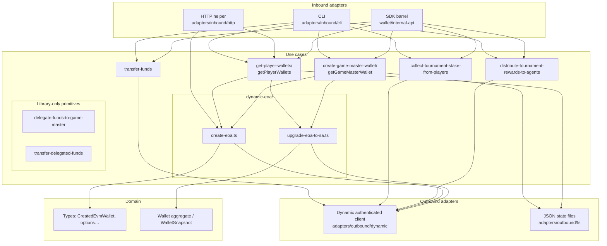

# wallet

Server-side EVM wallet creation using [Dynamic](https://www.dynamic.xyz/)’s Node EVM client (`@dynamic-labs-wallet/node-evm`). This package authenticates with your Dynamic environment, runs MPC key generation for new accounts, upgrades EOAs to ERC-7702 smart accounts (MetaMask Stateless7702), and exposes the result as domain snapshots (or you can import the helpers from your own code).

It also includes **game master** provisioning (ENS-backed, persisted), **named player wallets**, **native ETH transfers** between them, and **tournament stake / reward** flows with fixed amounts on **Sepolia** by default.

## Requirements

- Node.js 20+ (recommended)
- [pnpm](https://pnpm.io/) (see `packageManager` in `package.json`)

## Setup

1. From the repo root, install dependencies for this package:

   ```bash
   cd wallet && pnpm install
   ```

2. Copy the example env file and fill in values from the [Dynamic API / developer settings](https://app.dynamic.xyz/dashboard/developer/api):

   ```bash
   cp .env.example .env
   ```

   | Variable | Required | Description |
   |----------|----------|-------------|
   | `DYNAMIC_AUTH_TOKEN` | Yes | Server API token for Dynamic |
   | `DYNAMIC_ENVIRONMENT_ID` | Yes | Your Dynamic environment ID |
   | `WALLET_PASSWORD` | No | Optional password passed to wallet creation when supported |
   | `RPC_URL` | No | HTTP RPC for Sepolia (balances in CLI reports, txs). Defaults to the public Sepolia URL if unset |
   | `GAME_MASTER_WALLET_FILE` | No | Path to game master state JSON (default: `.game-master-wallet.json` in cwd) |
   | `PLAYER_WALLETS_FILE` | No | Path to player wallets JSON (default: `.player-wallets.json` in cwd) |

## Architecture

The package follows **hexagonal-style** layering: **inbound adapters** call **use cases**, which orchestrate **outbound adapters** and the **domain** model.



### Layers (what lives where)

| Layer | Path | Role |
|-------|------|------|
| **Inbound adapters** | `src/adapters/inbound/` | **CLI** (`wallet-cli.ts`), **HTTP** (`runCreateWalletsFromHttpBody` in `create-wallets.ts`), and **`wallet/internal-api`** — JSON-friendly wrappers (`getPlayersWallet`, `getGameMasterWallet`) plus re-exports of tournament and transfer use cases. |
| **Use cases** | `src/use-cases/` | **Game master** — `getGameMasterWallet`, `ensureGameMasterWallet`, `createGameMasterWallet`, `provisionGameMasterEoa`. **Players** — `getPlayerWallets`. **Transfers** — `transferFunds`. **Tournament** — `collectTournamentStakeFromPlayers`, `distributeTournamentRewardsToAgents` (fixed **0.01 ETH** stake; rewards to up to **3** agents). **Dynamic primitives** — `createEoa`, `upgradeEoaToSa`. **Delegation** (library) — `delegateFundsToGameMaster`, `transferDelegatedFunds`, `buildAgentDelegation`, `buildDelegatedTransfer`. Barrel **`use-cases/index.ts`** re-exports. |
| **Outbound adapters** | `src/adapters/outbound/` | **`createAuthenticatedEvmClient`** and Dynamic Node EVM typings; **filesystem** persistence for `.game-master-wallet.json` and `.player-wallets.json`. |
| **Domain** | `src/domain/` | **Types**, **`Wallet`** aggregate, **`WalletSnapshot`**, **`GAME_MASTER_ENS_NAME`**, **`ThresholdScheme`**. |

### HTTP integration (for your own server)

There is **no built-in HTTP server** in this package. Import **`runCreateWalletsFromHttpBody`** from the package root and call it from your route handler.

**`CreateWalletsHttpBody`** (see `src/adapters/inbound/http/create-wallets.ts`):

| Field | Required | Description |
|-------|----------|-------------|
| `authToken` | Yes | Dynamic server API token |
| `environmentId` | Yes | Dynamic environment ID |
| `count` | Yes | Number of wallets to create |
| `rpcUrl` | Yes | HTTP RPC URL used for chain operations |
| `password` | No | Optional wallet password |
| `chainId` | No | If set, must be supported in `CHAINS_BY_ID` (**Sepolia** or **Base Sepolia**); default behavior uses Sepolia when omitted |
| `playerEnsLabels` | No | If non-empty, must have **length === `count`**: uses **persisted** `getPlayerWallets` by those names instead of ephemeral EOAs |

Returns **`Wallet[]`** domain aggregates (named path) or **`Wallet.fromDynamicCreated`** rows (ephemeral EOAs).

### Why `createEoa` does not return a full `Wallet` yet

The **`Wallet`** class models **lifecycle after** an EOA exists: delegation signed, set-code tx, smart-account address, optional ENS. Dynamic returns a plain **`CreatedEvmWallet`** row from `createWalletAccount`; there is no `Wallet` instance until the ERC-7702 path starts.

So:

- **`createEoa`** returns **`CreatedEvmWallet[]`** (Dynamic’s shape).
- **`upgradeEoaToSa`** builds **`Wallet.fromDynamicCreated`**, then calls **`markDelegationSigned`**, **`recordSetCodeTransaction`**, and **`markSmartAccount`** as each step succeeds — that is where the aggregate is manipulated.

Use **`getPlayerWallets`** / **`getGameMasterWallet`** when you need names + persistence; they wrap **`createEoa`** / upgrades and build **`Wallet`** snapshots for storage.

## CLI

Unified entry: **`wallet-cli.ts`**. Scripts load `.env` via `tsx --env-file` / `node --env-file`.

```bash
# List commands and env vars
pnpm run wallet -- help
```

| Command | Aliases | Purpose |
|--------|---------|---------|
| `get-game-master-wallet` | `create-game-master-wallet`, `game-master-wallet`, `game-master` | Load or create the **game master** once (EOA + ENS), persist `.game-master-wallet.json`. Re-runs only print saved data. |
| `get-player-wallets` | `player-wallets` | Load or create wallets by **player name**; persist `.player-wallets.json`. |
| `transfer-funds` | — | Native ETH transfer: `transfer-funds <from> <to> <amountEth>`. **`from`** / **`to`**: player name or `gm` / `game-master` / `gamemaster`. |
| `collect-tournament-stake` | `collect-tournament-stake-from-players` | Each listed player sends **0.01 ETH** (native) to the game master treasury (sequential txs). Ensures GM + player wallets exist. |
| `distribute-tournament-rewards` | `distribute-rewards` | Game master sends **0.01 ETH** to each named agent (**1–3** recipients). Ensures GM + recipient wallets exist. |

Examples:

```bash
pnpm run wallet -- get-game-master-wallet
pnpm run wallet -- get-player-wallets alice bob
pnpm run wallet -- transfer-funds alice gm 0.05
pnpm run wallet -- collect-tournament-stake alice bob
pnpm run wallet -- distribute-tournament-rewards winner1 winner2
```

Dedicated `pnpm` shortcuts (see `package.json`). Pass arguments after `--` when the subcommand needs them:

```bash
pnpm run get-game-master-wallet
pnpm run get-player-wallets -- alice bob
pnpm run transfer-funds -- gm alice 0.05
pnpm run collect-tournament-stake -- alice bob
pnpm run distribute-tournament-rewards -- winner1 winner2
```

Compiled binary for any subcommand:

```bash
pnpm run wallet:build -- get-player-wallets alice
```

## Library usage

Build so `dist/` is available:

```bash
pnpm run build
```

### Package root (`wallet`)

Imports from `wallet` (see `src/index.ts` and `src/use-cases/index.ts`):

- **`runCreateWalletsFromHttpBody`**, **`CreateWalletsHttpBody`** — HTTP handler helper (see above).
- **`createAuthenticatedEvmClient`** — authenticated `DynamicEvmWalletClient`.
- **`getPlayerWallets`**, **`getGameMasterWallet`**, **`ensureGameMasterWallet`**, **`createGameMasterWallet`**, **`provisionGameMasterEoa`** — use cases with **`Wallet`** instances / file state.
- **`transferFunds`**, **`collectTournamentStakeFromPlayers`**, **`distributeTournamentRewardsToAgents`** — native ETH flows; constants **`TOURNAMENT_STAKING_PRICE_ETH`**, **`TOURNAMENT_STAKING_PRICE_WEI`**, **`MAX_TOURNAMENT_REWARD_RECIPIENTS`**.
- **`createEoa`**, **`upgradeEoaToSa`** — Dynamic primitives.
- **`delegateFundsToGameMaster`**, **`transferDelegatedFunds`**, **`buildAgentDelegation`**, **`buildDelegatedTransfer`** — delegation helpers (not exposed as CLI subcommands).
- Domain **`Wallet`**, **`WalletSnapshot`**, **`GAME_MASTER_ENS_NAME`**, **`ThresholdScheme`**, types.

Entry point: `src/index.ts` (exports mirror `dist/` after build).

### `wallet/internal-api`

Stable surface for other packages that want **plain JSON snapshots** instead of class instances (`src/adapters/inbound/sdk/internal-api.ts`):

- **`getPlayersWallet`** — like `getPlayerWallets`, returns **`wallets: WalletSnapshot[]`**, **`created`**, **`stateFilePath`**.
- **`getGameMasterWallet`** — returns **`wallet: WalletSnapshot`**, **`created`**, **`stateFilePath`**.
- **`transferFunds`**, **`collectTournamentStakeFromPlayers`**, **`distributeTournamentRewardsToAgents`** — same behavior as use cases, re-exported for convenience.
- Types and constants: **`TransferFundsParams`**, **`CollectTournamentStakeFromPlayersParams`**, **`DistributeTournamentRewardsToAgentsParams`**, **`TOURNAMENT_STAKING_PRICE_ETH`**, **`TOURNAMENT_STAKING_PRICE_WEI`**, **`MAX_TOURNAMENT_REWARD_RECIPIENTS`**, etc.

```ts
import {
  getPlayersWallet,
  getGameMasterWallet,
  transferFunds,
} from "wallet/internal-api";
```

## Scripts

| Script | Purpose |
|--------|---------|
| `pnpm run build` | TypeScript compile to `dist/` |
| `pnpm run typecheck` | `tsc --noEmit` |
| `pnpm run clean` | Remove `dist/` |
| `pnpm run wallet` | Unified CLI (`tsx` + `.env`); pass `help` or a subcommand |
| `pnpm run wallet:build` | Compiled unified CLI (`node` + `.env`) |
| `pnpm run get-game-master-wallet` | `get-game-master-wallet` via `tsx` |
| `pnpm run get-player-wallets` | `get-player-wallets` via `tsx` (pass names after the script) |
| `pnpm run transfer-funds` | `transfer-funds` via `tsx` |
| `pnpm run collect-tournament-stake` | `collect-tournament-stake` via `tsx` |
| `pnpm run distribute-tournament-rewards` | `distribute-tournament-rewards` via `tsx` |
| `pnpm run create-game-master-wallet` | Alias: `wallet -- create-game-master-wallet` |
| `pnpm run create-game-master-wallet:build` | Compiled `create-game-master-wallet` only |
